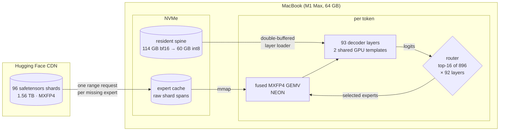
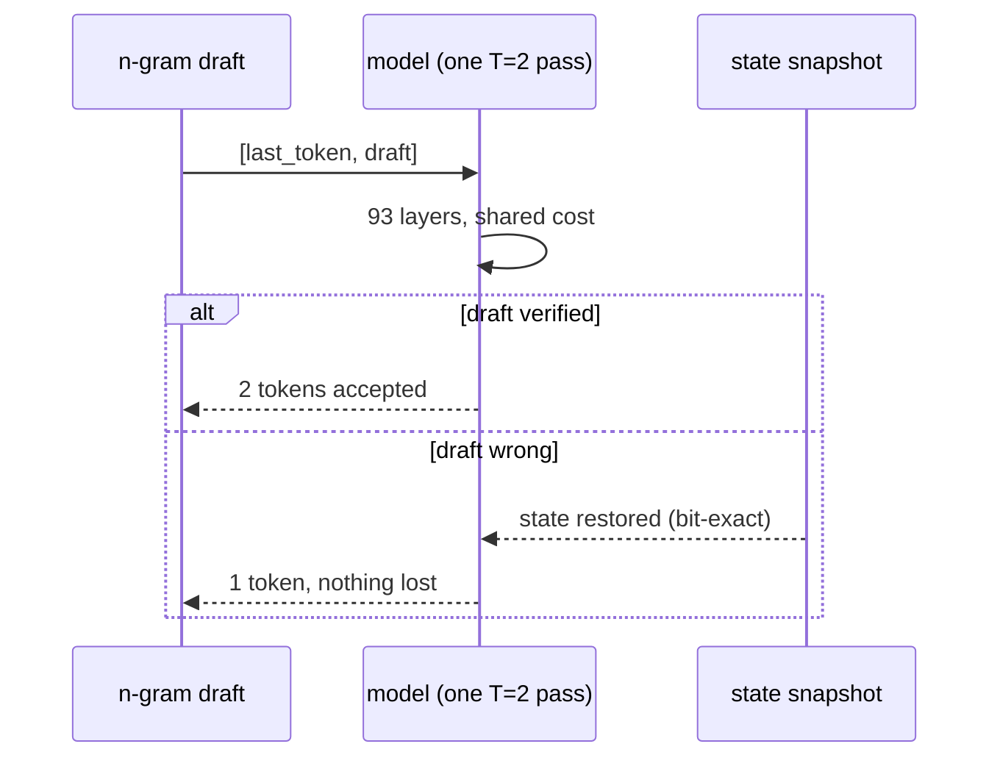

<div align="center">

```
   ____       _ _         __ _
        |  _ \  ___| | |_ __ _ / _(_)_ __
        | | | |/ _ \ | __/ _` | |_| | '_ \
        | |_| |  __/ | || (_| |  _| | | | |
        |____/ \___|_|\__\__,_|_| |_|_| |_|
```

### An experiment in running [Kimi K3](https://huggingface.co/moonshotai/Kimi-K3) (2.8T parameters) on one Apple Silicon Mac

Deltafin is a small research project that runs a Mixture-of-Experts model far
larger than the machine it sits on. The current exact-path median is **0.0687
token/s (14.6 seconds/token)** on our 64 GB M1 Max. Every published run so far
comes from that one first-generation machine—not a newer Max or Ultra—and
capability-gated paths plus automatic RAM budgeting carry the same engine
forward to newer Apple Silicon Macs.


-orange)


</div>

---

## Install

Clone the repository and enter it first; every path below is relative to the
Deltafin folder. The only real decision is step 3.

```bash
git clone https://github.com/gavamedia/deltafin.git
cd deltafin

# 1. environment (Python 3.12+, and Xcode CLT for clang)
python3 -m venv venv
./venv/bin/pip install torch numpy safetensors tiktoken ml_dtypes blobfile \
    "transformers==4.56.2" einops tokenizers

# 2. build the fused MXFP4 kernel
clang -O3 -mcpu=native -shared -DNO_MAIN -o tools/libmxfp4gemv.dylib tools/fused_gemv.c

# 3. download the model  (see the two modes below)
./venv/bin/python tools/setup_k3.py --full
```

### The two modes

| | `--full` (recommended) | `--stream` |
|---|---|---|
| Disk needed | **~1.7 TB** | **~215 GB** |
| Download time | 5–10 hours, resumable | ~30 minutes |
| Speed afterwards | **14.6 s/token median** on our M1 Max | ~3+ min/token for anything not already cached |
| Network at inference | none | constant |

Every token reads 16 experts × 92 layers = **25.8 GB of expert data**. From local
disk that's about 4 seconds; over the network it's minutes. That single fact is
the whole difference between the two columns.

Run `setup_k3.py` with no flag and it picks `--full` when the disk allows,
otherwise falls back to streaming and tells you exactly how much space you'd
need to free.

### Starting with streaming and upgrading later

Streaming is a fine way to try Deltafin without committing 1.7 TB. Whenever you
want the speed, one command finishes the job — no reinstall, no reconfiguration,
and it picks up whatever is already cached:

```bash
./venv/bin/python tools/fetch_experts_all.py          # resumable, run anytime
./venv/bin/python tools/fetch_experts_all.py --dry-run   # just show the numbers
./venv/bin/python tools/fetch_experts_all.py --layers 1-40   # partial is fine too
```

For a streaming install, an idle-time warmer can rank absent experts from
recorded router traces. Its default is a read-only plan; network fetching is
explicit, and it can atomically convert legacy `.npz` entries to the raw fast
format:

```bash
./venv/bin/python tools/warm_expert_cache.py
./venv/bin/python tools/warm_expert_cache.py --convert-npz --fetch 128
```

Deltafin prints a reminder at startup — both for the CLI and the API server —
whenever it's still in streaming mode, showing how much of the pool is local and
what finishing would cost.

### Optional: int8 spine

Halves per-token I/O for the non-expert weights, with no meaningful quality
change in our checks. Takes a few minutes:

```bash
./venv/bin/python tools/convert_spine_int8.py
```

## Usage

```bash
# ask a question; generates until the model finishes its answer
./venv/bin/python tools/kimi_run.py --chat --prompt "What are the three largest moons of Saturn?"

# raw completion (no chat template); runs until you press Ctrl-C, or cap it
./venv/bin/python tools/kimi_run.py --prompt "The capital of France is" --max-new 16
```

Tokens print as they are generated, so you always see the text as it comes.
Ctrl-C stops cleanly at any point and prints the result so far; `--max-new N`
caps the length. One honest warning: K3 thinks before it answers, and at roughly
4.1 tokens per minute a full chat answer can take a while — watching it stream
is part of the experience.

Set `K3_TRACE=buffered` to log router selections to `router_trace.jsonl` for
offline study. Performance runs leave tracing off.

## OpenAI-compatible server

Deltafin can serve the standard OpenAI API, so chat interfaces, the `openai` SDK
and coding agents can use it by changing a base URL:

```bash
./venv/bin/python tools/serve_openai.py --port 8000
```

```bash
curl http://127.0.0.1:8000/v1/chat/completions -H 'Content-Type: application/json' \
  -d '{"model": "deltafin-kimi-k3",
       "messages": [{"role": "user", "content": "Hello!"}]}'
```

```python
from openai import OpenAI

client = OpenAI(base_url="http://127.0.0.1:8000/v1", api_key="none")
r = client.chat.completions.create(
    model="deltafin-kimi-k3",
    messages=[{"role": "user", "content": "Hello!"}])

print(r.choices[0].message.content)            # the answer
print(r.choices[0].message.reasoning_content)  # K3's thinking, when present
```

`/v1/chat/completions`, `/v1/completions` and `/v1/models` are implemented, and
streaming (`"stream": true`) works. Most tools that read `OPENAI_BASE_URL` and
`OPENAI_API_KEY` will work by pointing those at the server.

Please read these caveats before pointing anything automated at it:

- **Time.** Answers arrive when they arrive — set your client's timeouts to
  hours, not seconds. Omitting `max_tokens` lets the model finish its answer
  (recommended); raw completions, which never end on their own, default to 256.
  Operators can set a hard ceiling with `K3_SERVER_MAX_TOKENS`.
- **Streaming installs are much slower here.** A chat-template prompt is 60
  tokens or more and prefill touches many experts per layer, so on a partly
  filled cache a chat request can spend hours fetching. With a full install it's
  just normal (slow) inference. The server prints a warning at startup when
  you're in streaming mode.
- **Greedy only.** `temperature` and `top_p` are accepted and ignored, and one
  request runs at a time (a second concurrent request gets a 429).
- **Agents are a curiosity, not a workflow.** Coding assistants work in
  principle, but their long system prompts make prefill expensive.

## Configuration

Everything works with no configuration: Deltafin picks the GPU when there is
one and the int8 spine when it has been built, and says what it chose at
startup. These variables exist for overriding that:

| Variable | Default | Meaning |
|---|---|---|
| `K3_DEV` | auto | GPU (`mps`) when available, else `cpu` |
| `K3_SPINE` | auto | `int8` when built (recommended), else `bf16` |
| `K3_INT8_LM_HEAD` | `1` | packed MPS int8 output head when supported; exact dense fallback remains available |
| `K3_INT8_KDA_QKV` | `0` | experimental packed-int8 KDA Q/K/V path; set `1` to enable its capability-gated, sequence-parity-checked MPS implementation |
| `K3_SPEC` | `1` | n-gram speculation (lossless) |
| `K3_TEMPLATES` | `1` | template-layer buffer reuse |
| `K3_PRELOAD` / `K3_PREFETCH` | `1` | background layer loading / expert prefetch |
| `K3_METAL_POSITION_BATCH` | `0` | exact opt-in T>1 position-major Metal MoE; measured +2.0% on accepted speculative passes and should be retuned per Mac |
| `K3_MOE_TOP_K` | `16` | explicit quality/speed dial; fewer routed experts reduce expert bytes and can change output |
| `K3_CPU_MOE_BATCH` | `auto` | exact persistent CPU MXFP4 worker ring; padded counters measured +3.6% at eight threads |
| `K3_ASYNC_CACHE_WRITE` | `0` | opt-in cache-miss write overlap; `K3_CACHE_WRITE_QUEUE` (4) bounds outstanding buffers and `K3_CACHE_WRITE_WORKERS` (1) is retunable per Mac |
| `K3_APPROX` | `0` | fp16 numerics; not reproducible at near-ties |
| `K3_RAM_GB` / `K3_PIN_LAYERS` | auto | override the RAM budget |
| `K3_PROFILE` | `0` | per-phase timing for each pass |
| `K3_TRACE` | `off` | `buffered` writes one router-trace block per pass; `sync` writes each layer immediately |
| `DELTAFIN_ROOT` | repo root | where caches and weights live |
| `K3_HF_HOST` / `K3_HF_PATH` | Hugging Face | point expert fetching at a mirror |
| `K3_SERVER_MAX_TOKENS` | unlimited | optional hard ceiling on server generations |
| `K3_RESPONSE_MEMO_ENTRIES` | `32` | exact in-process replay cache for identical deterministic API requests; `0` disables |

## Requirements

- An Apple Silicon Mac. All published numbers are from the same first-generation
  M1 Max with 64 GB—the only Mac benchmarked so far. More RAM is used
  automatically (a 128 GB machine pins several times more of the model), and
  newer chips can bring higher memory bandwidth, more GPU resources, and faster
  storage. See
  [Why newer Macs should be faster](#why-newer-macs-should-be-faster).
- Xcode Command Line Tools, for `clang` (`xcode-select --install`).
- Python 3.12 or newer.
- Disk: ~1.7 TB for the full install, ~215 GB for streaming (see [Install](#install)).
- Network access to Hugging Face.

## How it works

K3's weights total about 1.56 TB, which is more than this machine's free disk, let
alone its RAM. The observation that makes local inference possible anyway is that a
Mixture-of-Experts model only *touches* a small fraction of itself per token.

- **The resident spine** (~114 GB: attention, shared experts, latent projections,
  embeddings) is downloaded once and read layer-by-layer from local NVMe each token,
  quantized to int8 and computed on the GPU.
- **The 82,432 routed experts** (~1.45 TB). For each token K3's router picks 16
  experts per layer, and only those are read. Install them all locally if you can
  (recommended); otherwise Deltafin fetches them from Hugging Face on demand —
  one HTTP range request per expert — into a growing disk cache.
- **The forward pass** runs Moonshot's own modeling code, unmodified. A small
  pure-PyTorch shim stands in for the CUDA-only `fla` kernels it expects.



## What to expect

All current numbers below were measured on **one M1 Max (10-core CPU, 32-core
GPU, 64 GB, internal NVMe)** with the full model installed locally, int8
resident weights and output head, Metal MoE, exact fp32 numerics, greedy
decoding, and tracing disabled.

The current column pools **six exact full-model runs** from balanced ABBA/BAAB
campaigns. Each run used the five-token prompt `The capital of France is`,
verified the three-token completion ` Paris. The`, and discarded the first
decode step before reporting steady throughput. Values are medians; the range
shows how much this I/O-heavy workload moved even on the same quiet machine.

| Metric | First working version | Current M1 Max benchmark | Change |
|---|---|---|---|
| Prefill / first token (5-token prompt) | 2,429 s | **28.0 s median** (24.9–37.9 s) | ~87× |
| Steady decode, experts local | ~20 min/token | **0.0687 token/s** (**14.6 s/token**); 0.0503–0.0779 token/s run range | ~82× |
| Exact three-token generation, model time | — | **56.5 s median** | — |
| Fresh-process wall time for the same run | — | **64.1 s median** | — |
| Decode, experts streamed | ~20 min/token | ~3 min/token | network-bound |

> This is the “measly M1” result: an aging first-generation M1 Max, not a newer
> Max or Ultra. It is a conservative reference point, not a cross-Mac benchmark.
> We expect newer, higher-bandwidth and higher-RAM systems to do better, but will
> label those numbers separately when someone measures them.

### Recent exact-path improvements

The newest measurements below are balanced A/Bs on the same M1 Max. Token
oracles were checked for every full-model run.

| Change | Measured result | Shipping behavior |
|---|---|---|
| Packed MPS int8 output head | **+17.3%** median steady decode, **+23.1%** prefill, and **+26.8%** wall throughput; resident head storage fell from 4.7 GB to 1.17 GB | enabled when the operator and int8 weights are available, with an exception-guarded dense fallback |
| Packed MPS int8 KDA Q/K/V | An initial balanced two-pair full-model A/B measured **+2.8%** median steady decode and **−4.7%** prefill; the run ranges overlap, so more repetitions are welcome | sequence-parity-checked opt-in via `K3_INT8_KDA_QKV=1`; capability-gated, with dense fallback on setup or backend failure |
| Reference-only speculative snapshots | 0.001 ms instead of 3.56 ms and no ~475 MB state clone | enabled by default; replay and partial-accept tests preserve the exact future sequence |
| Position-major Metal MoE for accepted drafts | **+4.7%** on a real T=2 layer and **+2.0%** pooled full-model throughput | exact opt-in via `K3_METAL_POSITION_BATCH=1`, pending per-Mac tuning |
| 128-byte-aligned CPU worker counters | **+0.2%** at four threads and **+3.6%** at eight threads | automatic in the persistent CPU fallback |

The median works out to roughly **4.1 tokens per minute**. A representative M1
Max profile is dominated by:

| | |
|---|---|
| waiting on the resident spine read (53 GB) | ~5 s |
| reading the 16 selected experts per layer (25.8 GB) | ~4.3 s |
| applying the spine (transfer + dequant) | ~3 s |
| attention and norms (93 layers) | ~2 s |
| MoE expert matmuls | ~1 s |

Decode is now **bound by disk bandwidth on the resident spine**. Those 53 GB are
re-read every token, and at the ~7 GB/s this access pattern sustains that is about
7.5 s of the 14.6-second median—unavoidable without either more RAM (enough to
hold the spine without displacing the page cache the expert reads need) or a
smaller spine.

### Why newer Macs should be faster

Every one of those lines is bound by hardware that changes across Apple Silicon.
No path is hard-disabled by an M1 result, but several fallback values were
measured here; a newer machine should retune them under its own capability,
runtime, memory, and storage fingerprint:

- **Memory bandwidth.** The M1 Max has 400 GB/s. An M3/M4 Max is meaningfully
  higher and an Ultra roughly doubles it — that lands directly on the spine load
  and the expert matmuls.
- **GPU.** More cores execute the same Metal kernels faster; the dequant shader
  and the attention path both scale with it.
- **SSD.** Expert reads are the single biggest slice, and they run at whatever
  the internal drive delivers. Later Macs ship faster NVMe.
- **RAM.** This matters most. The 53 GB spine does not fit alongside everything
  else on a 64 GB machine, so it is re-read from disk every token — about half
  the total time. On a 128 GB machine it can simply stay in the page cache, and
  that cost largely disappears. Deltafin also pins more of the model there
  automatically, with no flags.

Runtime selection is based on Metal feature-family and operator capability
checks rather than chip-name strings. That keeps newer families—including M5—
eligible for paths an M1 cannot execute, while every optional native path retains
an exact fallback.

We have only benchmarked this on that M1 Max. **If you try it on an M3, M4 or
M5, an Ultra, or a machine with 128 GB or more, we would genuinely like to see
your numbers**—open an issue with the output of `K3_PROFILE=1` and your chip.

When n-gram speculation accepts a draft, one forward pass emits two tokens, so
repetitive text runs proportionally faster. Speculation is lossless: accepted
drafts reproduce the reference sequence exactly, and a rejected draft restores
the model state bit-for-bit.

The gap between the two decode rows is the whole argument for the full install
([see above](#the-two-modes)): with the experts local, every prompt runs at the
top-row speed instead of only the ones whose experts happen to be cached.

Output is greedy and reproducible: the same prompt yields the same tokens, run
after run.

> `The capital of France is` → ` Paris. The Eiffel Tower is located in Paris. The Louvre Museum is also in Paris. The Louvre has…`

To be clear about the limitations: this is a research artifact, not a practical
chat setup. A 14.6-second median token is a long way from interactive, and long
prompts are expensive because prefill touches many experts. We think it is
interesting mainly as an existence proof, and as a testbed for
streaming-inference techniques.

## Techniques

Each technique below was measured on real weights before it was retained. Little
of this is novel on its own; most of it adapts ideas from the projects credited
below to K3's particular shape.

### I/O and streaming

- **Coalesced expert fetch.** Each expert's six tensors happen to be contiguous in
  the shard files (we checked all 82,432), so a whole expert is a single 17.55 MB
  range request over a small pool of keep-alive connections. That measured about
  6.4× faster than fetching tensors individually.
- **Raw-span disk cache.** Cache files are the shard bytes verbatim — no container
  format, no parsing.
- **Parallel expert reads.** A layer's 16 selected experts are read together by a
  thread pool using `pread` with `F_NOCACHE`, rather than being demand-faulted
  page by page while the kernel computes. Measured cold: 0.87 GB/s faulting
  versus 6.85 GB/s reading. This was worth 40 s → 4.3 s per token on the read
  path alone, and `F_NOCACHE` keeps 25 GB/token of expert traffic from evicting
  the page cache the spine needs.
- **Double-buffered layer loading.** A worker thread reads the next layer's spine
  data while the current layer computes.
- **Previous-token prefetch.** Consecutive tokens reuse about 31% of their expert
  selections on a deduplicated holdout, so each token's set is fetched in the
  background for the next one.

### Compute

- **Fused MXFP4 dequant+GEMV** ([`tools/fused_gemv.c`](tools/fused_gemv.c)) — a
  NEON kernel that dequantizes and multiplies in one pass using a 16-entry table
  lookup, with the e8m0 scale applied as integer arithmetic on the fp32 exponent.
  It matches the reference implementation bit-for-bit and replaced a much slower
  dequantize-then-matmul path. A Metal version exists as a validated prototype.
- **Template-layer buffer reuse.** All 69 KDA layers share one set of tensor
  shapes and all 24 MLA layers another, so two persistent GPU-resident "template"
  layers can receive each layer's weights via `copy_()`. This avoids the allocator
  churn that profiling showed was a large share of per-token time.
- **int8 resident spine.** Halves the per-token resident I/O. In our checks the
  top-5 next-token candidates kept their order and the top logit moved by 0.07%.
- **Custom Metal dequant kernel.** Loading the spine spent most of its time in a
  row-broadcast multiply that MPS runs at 43 GB/s, against 334 GB/s for a plain
  copy of the same bytes. A small `compile_shader` kernel fusing int8→fp32, the
  row scale, and the copy reaches 297 GB/s; with persistent staging buffers and
  transfers hoisted out from between dispatches, per-layer load went 118 ms →
  21 ms. Bit-exact: `max|diff| = 0` on every tensor.
- **Packed int8 output head.** The built-in MPS weight-only matmul consumes the
  existing row-int8 checkpoint directly, avoiding a 4.7 GB fp32 head and its
  dequantization. Capability checks and a caught dense fallback preserve support
  across PyTorch releases and Apple GPU families.
- **Packed int8 KDA projections.** The same native MPS operator consumes each
  KDA layer's Q/K/V matrices directly from the row-int8 spine. The two reusable
  KDA templates share one 252 MiB packed arena, so those three large matrices
  are neither dequantized nor retained as dense fp32 weights. This remains an
  sequence-parity-checked opt-in while its early A/B is repeated; capability
  and failure guards preserve the dense path.
- **Pure-PyTorch KDA shim** ([`tools/fla/`](tools/fla)) — Kimi Delta Attention's
  recurrence, short convolution, and gated norm, ported from fla-core's semantics.
  Chunked and step-by-step execution agree to about 1e-9. At decode the recurrence
  runs on CPU, where its small state fits better than a series of GPU dispatches.

### Decoding

- **N-gram speculation.** Drafts come free from suffix matching against the text
  so far, and are verified in a two-position batch whose fixed costs are shared.
  This is worthwhile here precisely because resident I/O and compute — not expert
  fetching — dominate a warm token. Accepted drafts reproduced the reference
  sequence exactly in our tests. Rollback retains the old immutable state
  objects instead of cloning ~475 MB, then restores them in constant time; replay
  tests preserve the exact future sequence.



### Scaling with RAM

- At startup Deltafin reserves memory for the OS (`max(10 GB, 18%)`) and pins as
  many resident layers as the remainder allows. A 128 GB machine pins several
  times more than a 64 GB one without any configuration, and the expert cache
  additionally benefits from whatever page cache is free.

## Where this could go

Roughly in order: the Metal expert kernels (already prototyped), a proper quality
harness — average NLL against the official API — so lossy speed/quality
trade-offs can be measured rather than argued about, smarter expert prefetching,
and eventually a native engine in the spirit of ds4, where most of the remaining
overhead should disappear.

## Thanks

Deltafin leans heavily on work that others published openly. In rough order of
influence:

- **[colibri](https://github.com/JustVugg/colibri)** (JustVugg, Apache-2.0) —
  showed that a 744B MoE can run in 25 GB of RAM, and is where we learned about
  router-lookahead prefetch, learned expert pinning, `F_NOCACHE` and `F_RDADVISE`
  discipline on macOS, and the shard-by-shard conversion pattern. Its M5 Max
  performance report — CPU spin-waits starving the GPU of a shared power budget —
  changed how we schedule work.
- **[ds4 / DwarfStar](https://github.com/antirez/ds4)** (Salvatore Sanfilippo,
  MIT) — the clearest expert-streaming design we studied: zero-copy expert
  buffers, masked dispatch, selection-based cache eviction, session persistence,
  and a quality methodology (average NLL against official API outputs) that we
  adopted outright. Its stated philosophy — correctness before speed, hide I/O
  behind compute — is the sensible one, and we tried to follow it.
- **[Moonshot AI](https://huggingface.co/moonshotai/Kimi-K3)** — for releasing
  K3's weights openly with readable modeling code, which Deltafin runs directly,
  and for the Kimi Delta Attention design, whose small recurrent state is what
  makes long context feasible on a laptop at all.
- **[flash-linear-attention](https://github.com/fla-org/flash-linear-attention)**
  (fla-org, MIT) — our KDA shim is a port of semantics from its kernels and
  reference implementations.
- **[llama.cpp / ggml](https://github.com/ggml-org/llama.cpp)** — prior art for
  in-kernel dequantization and MXFP4 handling, and the foundation of most of what
  the local-inference community knows.
- **[PyTorch](https://github.com/pytorch/pytorch)**,
  **[Transformers](https://github.com/huggingface/transformers)**,
  **[ml_dtypes](https://github.com/jax-ml/ml_dtypes)** (our bit-exactness
  reference for e2m1) and **[tiktoken](https://github.com/openai/tiktoken)**.

## License

Deltafin's own code is [MIT](LICENSE). Two things in this repository are not ours:

- [`tools/fla/`](tools/fla) is a pure-PyTorch port of semantics from
  flash-linear-attention (MIT, © 2023–2026 Songlin Yang, Yu Zhang, Zhiyuan Li).
  The attribution is repeated in the file header and in [LICENSE](LICENSE).
- Kimi K3's weights and modeling code belong to Moonshot AI and are distributed
  under Moonshot's own license. They are downloaded at setup, never vendored
  here — please read that license before using them.

Deltafin is an independent project with no affiliation to Moonshot AI.
